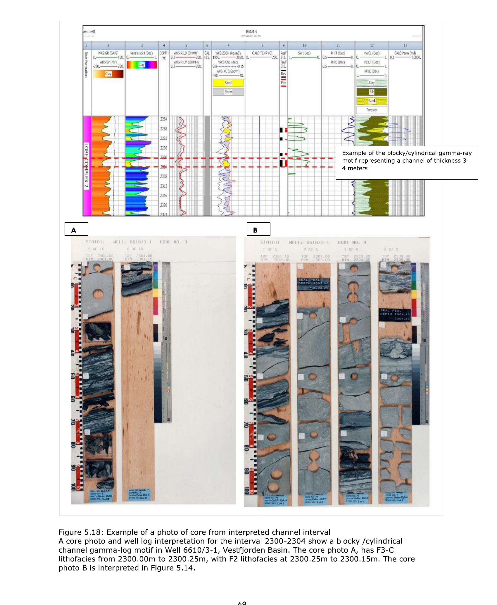
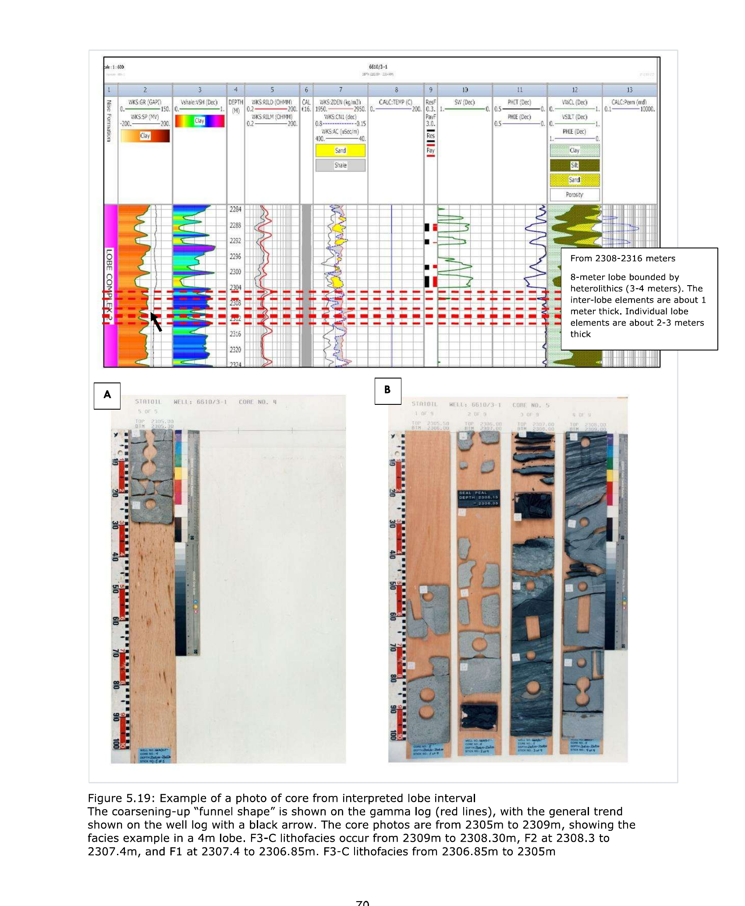

# Nise Formation Reservoir Characterization & Dynamic Flow Simulation

Static-to-dynamic reservoir characterization of the Upper Cretaceous deep marine Nise Formation on the eastern Vøring Margin, Norwegian Sea: 
Petrophysical interpretation of 4 wells, a custom-built 3D geological grid, and gas flow simulation across 3 well-placement scenarios. 
Estimated Gas-in-Place: **320 million Sm³**.

This repository contains the original Python grid-generation script and OPM Flow simulation decks behind my MSc thesis at NTNU 
(Department of Geoscience and Petroleum). Supervised by NTNU and Equinor.

## Why the Nise Formation

The Nise Formation lies stratigraphically above most of the producing Jurassic fields on the Eastern Vøring Margin of the Norwegian Sea (Halten Terrace, Nordland Ridge) and is penetrated by a large share of ongoing exploration in the area, yet it has received very little dedicated characterization. 
Additionally, it has a regulatory dimension: wells passing through the Nise in hydrocarbon zones require effective plugging and abandonment to prevent gas migration into the well-casing annulus. Hence, its flow behavior matters beyond exploration upside alone.


## Data & tools

•	Well log and core data for 4 wells: 6407/1-4, 6407/4-1, 6407/2-1 in the Halten Terrace, and 6610/3-1 in the Vestfjorden Basin, were obtained from NPD/DISKOS. 

•	Petrophysical interpretation (shale volume, porosity, water saturation, and permeability) was performed in Interactive Petrophysics (IP).

•	The 3D geological grid (2,250,000 cells) was built from scratch in Python (NumPy, GSTools, Matplotlib). 

•	Dynamic simulation was run in OPM Flow, the open-source reservoir simulator co-developed by Equinor, and the results were visualized in ResInsight. 

•	PVT and relative permeability data are from Equinor's Open Database License dataset.

**Note on data**: well-completion reports and raw LAS files were downloaded from DISKOS under confidentiality terms and aren't redistributed here. Core photos are public-domain NPD material (NPD, 2024a) and are used below with that attribution. Everything else in this repository (code, simulation decks, and derived figures) is either original or carries an explicit open license.

## Tying core to log: defining the channel and lobe architecture

Lithofacies were first described from core photographs; lithology, grain size, sorting, and sedimentary structure. 
Then calibrated against the gamma-ray and resistivity log responses. 
This calibration allowed the same channel and lobe motifs to be recognized in the uncored well intervals.


A blocky, cylindrical gamma-ray motif over a 3-4m interval in Well 6610/3-1 calibrates to a channel fill in core. The F3-C sandstone subfacies consist of poorly to well-sorted, fine to medium to coarse-grained, amalgamated white to dark grey sandstones. The F2 heterolithics are thin sandstone/siltstone layers (≤ 0.05 meters thick) interbedded with predominantly dark grey to black mudstones, exhibiting varying levels of bioturbation .


A coarsening-upward "funnel" gamma-ray trend over an 8 m interval in the same well calibrates to a lobe complex, with F1 hemipelagic mudstone capping an upward transition through F2 into F3-C sandstone. The F1 are 0.01-0.2m thick dark grey to black mudstone observed in the cores. The F2 heterolithics are thin sandstone/siltstone layers, whiles F3 lithofacies are sandstones. 


Lithofacies thickness varies considerably across the three cored wells. 6407/1-4 is dominated by heterolithics (F2), whereas 6610/3-1 shows the most extensive channel-to-lobe sandstone development. The dynamic model's channel and lobe dimensions are informed by well 6610/3-1 and the published analogs to reduce model uncertainty.

## Workflow


Concept model from core photos, well logs, and analogs → petrophysical interpretation in IP → object-based 3D grid in Python → dynamic simulation in OPM Flow → visualization and forecasting in ResInsight.

## Building the model

Channel and lobe geometry was dimensioned using deep-marine analogs — the Frysjaodden Formation (Norway), Karoo Basin (South Africa), and the Jaca and Ainsa Basins (Spain) — where the four wells alone couldn't constrain lateral extent. [`scripts/createGrid.py`](scripts/createGrid.py) builds a 150×300×50 cell grid (30 m × 100 m × 1 m per cell) containing two stacked lobes and a feeder channel, assigns porosity through a Gaussian random field centered on facies-specific means (0.20 in the channel, 0.15 in the lobes), and derives permeability through a power-law fit calibrated against the IP well-log analysis (10–121 mD across the model).


## Dynamic simulation & results

Three single-well scenarios in [`simulation/`](simulation/) test how placement affects recoverable gas: PROD A sits on the channel/lobe axis, PROD B is off-axis through two lobes, and PROD C sits at a lobe fringe near the gas-water contact. Each was run independently — the other two wells shut — at an initial pressure of 210 bar against a 190 bar BHP constraint, over one year of production.


| Well | Position | Year-end cumulative production | Recovery factor |
|---|---|---|---|
| PROD A | Channel/lobe axis | 2.25 MMSm³ | 1.0% |
| PROD B | Two lobes, off-axis | 1.13 MMSm³ | 0.4% |
| PROD C | Lobe fringe, near GWC | 0.54 MMSm³ | 0.17% |


PROD A produced roughly four times PROD C's total, tracking the permeability and porosity falloff away from the channel axis (18–25% porosity and 50–121 mD in the channel versus 9–20% and 10–62 mD in the lobes). PROD C still produced a meaningful volume despite sitting at the lobe fringe, which points to the channel-lobe system staying hydraulically connected even where individual architectural elements are weaker on their own.

## Decisions & trade-offs

Object-based facies modeling was used instead of a pixel-based approach so the channel and lobe geometry could be tied directly to a depositional concept (Walker's submarine fan model) rather than to a generic statistical texture. Where the four wells couldn't constrain lateral geometry, dimensions were borrowed from published analogs — a standard approach for sparse subsurface data, but one that carries irreducible uncertainty the model doesn't capture on its own. OPM Flow was chosen over a commercial simulator partly for access and partly because it's the same open-source engine Equinor develops and runs internally. The three scenarios are single-well, one-year runs rather than a full multi-well depletion schedule — enough to compare placement sensitivity, not enough to forecast field-level economics; that's a natural next step.

## Limitations

Four wells and three cores is a thin dataset for a formation this heterogeneous, and the lateral continuity assumptions lean on analogs rather than local data. A fuller assessment would bring in more wells, longer simulation horizons, and a proper sensitivity sweep on the analog-derived geometry parameters.

## Reproducing this

```bash
pip install numpy matplotlib gstools
python scripts/createGrid.py              # writes PORO.INC, PERM.INC, FIPNUM.INC
flow simulation/TWOPHASE3D_GAS_A.DATA      # requires OPM Flow; swap in _B or _C for the other scenarios
```

`PORO.INC`, `PERM.INC`, and `FIPNUM.INC` are regenerated rather than stored in this repo — each is 2,250,000 lines of raw per-cell values.

## Background

MSc Petroleum Geosciences, NTNU — Department of Geoscience and Petroleum. Thesis: *"Reservoir Characterization and Hydrocarbon Flow Potential of the Upper Cretaceous Nise Formation: Halten Terrace and Nordland Ridge, Offshore Mid-Norway"* (January 2025). Supervised by Arve Næss (NTNU/Equinor) and Carl Fredrik Berg (NTNU). Full thesis available on request.

[LinkedIn](https://www.linkedin.com/in/linda-afrifa)
